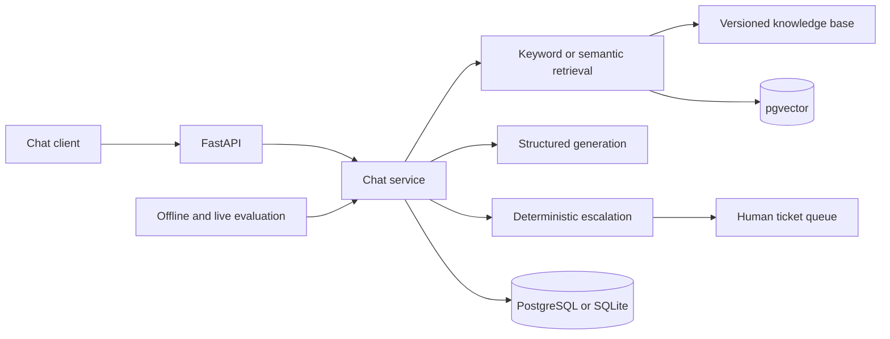

# Customer Support AI

[](https://github.com/kaungkhantnaynay/Customer_Support_Chat_Bot/actions/workflows/quality.yml)

Customer Support AI is a FastAPI service for grounded support conversations. It
retrieves trusted documentation, cites the evidence used in each answer, and creates a
human-review ticket when confidence or policy rules make automation unsafe.

## Architecture



The offline mode is deterministic and requires no model credentials. OpenAI mode adds
embeddings and structured generation while retaining citation validation, bounded
conversation history, refusal behavior, and deterministic escalation.

## Engineering highlights

- Source-grounded answers with validated citation identifiers
- Human escalation for billing, account-specific, angry, unsafe, or low-confidence cases
- Hashed conversation credentials and ownership checks for follow-ups and feedback
- PostgreSQL migrations and optional persistent pgvector indexes
- Offline regression suite covering 27 support scenarios across five knowledge areas
- Bounded live-model evaluation with calibration and held-out datasets
- Docker deployment, health checks, Ruff, pytest, and GitHub Actions
- Separate BeanCO knowledge pack and same-origin storefront integration contract

## Technology stack

- Python 3.12+, FastAPI, Pydantic, SQLAlchemy, and Alembic
- PostgreSQL with pgvector; SQLite for isolated local development
- OpenAI Responses API and embeddings in optional online mode
- pytest, Ruff, Docker Compose, and GitHub Actions

## Quick start

```bash
uv sync
cp .env.example .env
uv run python scripts/migrate_database.py
uv run uvicorn app.main:app --reload
```

Open the chat UI at <http://127.0.0.1:8000>, API documentation at
<http://127.0.0.1:8000/docs>, and the configured admin workspace at
<http://127.0.0.1:8000/admin>.

To run the containerized demo:

```bash
docker compose up --build
```

## Verification

```bash
uv run ruff check .
uv run ruff format --check .
uv run pytest -q
uv run --locked python scripts/run_evaluation.py \
  --report reports/evaluation.json
```

CI runs linting, tests against SQLite and PostgreSQL, and offline evaluation without
API credentials.
The evaluator reports retrieval, citation, grounding, refusal, and escalation results
separately and retains per-example diagnostics.

## Runtime modes

The default `AI_MODE=offline` uses local retrieval and document excerpts. It is useful
for development, repeatable tests, and no-cost demonstrations.

`AI_MODE=openai` enables semantic retrieval and structured model generation. Model
names, score thresholds, timeouts, vector storage, and bounded history are controlled
through environment variables documented in `.env.example`. Secrets remain on the
server; generated citations are accepted only when they match retrieved chunks.

Before treating OpenAI mode as production-ready, run the documented live evaluation,
review its results, and calibrate thresholds against representative traffic. Automated
grades require human review.

## Security and limitations

- Admin access is disabled unless credentials are configured.
- Conversation tokens are returned once and stored only as hashes.
- Provider errors, incomplete output, invalid citations, and weak evidence fail safely.
- User messages may contain personal data; the service is not a PII-redaction system.
- Preview deployment settings are for demonstrations, not dependable production use.
- Live-model calibration and a production privacy review remain release requirements.

See [SECURITY.md](SECURITY.md) for vulnerability reporting and
[production storage](docs/PRODUCTION_STORAGE.md) for migration and database guidance.

## Documentation

- [Architecture](docs/ARCHITECTURE.md)
- [Roadmap and current status](docs/ROADMAP.md)
- [Development guide](docs/DEVELOPMENT.md)
- [Evaluation design](docs/PHASE_7_QUALITY_AND_READINESS.md)
- [Live AI evaluation](docs/LIVE_AI_EVALUATION.md)
- [Production storage](docs/PRODUCTION_STORAGE.md)
- [BeanCO integration](docs/BEANCO_INTEGRATION.md)
- [Render deployment](docs/RENDER_DEPLOYMENT.md)
- [Verification record](docs/VERIFICATION.md)

## API surface

```text
GET   /health
GET   /knowledge/search?q=refund
POST  /chat
POST  /feedback
GET   /admin/tickets
GET   /admin/tickets/{ticket_id}
PATCH /admin/tickets/{ticket_id}
```
