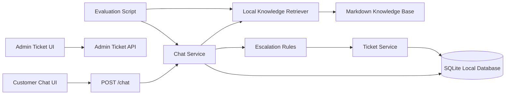

# Architecture

## Runtime Flow

1. A customer asks a support question in the chat UI.
2. The chat API stores the user message.
3. The local retriever searches trusted markdown support documents.
4. The chat service answers with source citations or refuses weak context.
5. Escalation rules decide whether a human ticket is required.
6. Admin users review and update tickets in the ticket workspace.

## Quality Gate

The evaluation script runs offline and checks:

- retrieval accuracy
- citation presence and source match
- refusal behavior for missing context
- forbidden unsupported claims
- escalation decisions

## Optional OpenAI Runtime

`AI_MODE=openai` replaces keyword vectors with OpenAI embeddings while retaining
local cosine search. Content-keyed document indexes are cached per process.
`AnswerEngine` supplies the retriever, generator, and score thresholds to chat;
tests and the offline evaluation runner can inject an independent engine.

After retrieval, the Responses API receives the current question, bounded
conversation history, and source chunks. A structured result supplies answer
text, supporting chunk IDs, and an abstention flag. The server validates chunk
IDs, builds citation labels, and applies the existing deterministic escalation
rules. Provider failures produce a low-confidence answer and ticket.

Chat and knowledge search use synchronous FastAPI handlers so synchronous SDK
calls run in the thread pool rather than blocking the event loop. No external
calls occur in offline mode. Semantic thresholds and generated-answer quality
still require live calibration; mocked tests validate integration behavior only.

## Automated Quality Checks

GitHub Actions runs pytest, Ruff, and the offline evaluator on Python 3.12 and
3.14. Evaluation uses its own in-memory database and an explicitly injected
offline engine. Each scenario starts a new conversation; optional history turns
continue that conversation before the final checked question.

The runner produces category totals and a versioned JSON report containing
per-example outputs, retrieved sources and scores, confidence, escalation reason,
and failures. CI retains this report as an artifact even when checks fail.
See [Phase 7](PHASE_7_QUALITY_AND_READINESS.md) for coverage and limitations.

## Production Storage

Alembic manages the support schema and vector table. The app checks the migration
revision on first database access. Docker Compose runs a migration service before
the app. PostgreSQL uses Psycopg 3 and SQLAlchemy connection pooling.

`VECTOR_STORE=pgvector` selects persistent exact cosine search scoped to an
immutable document/model snapshot. `scripts/index_knowledge.py` builds snapshots
explicitly; requests never re-embed the document collection. See
[Production storage](PRODUCTION_STORAGE.md) for deployment and verification.
